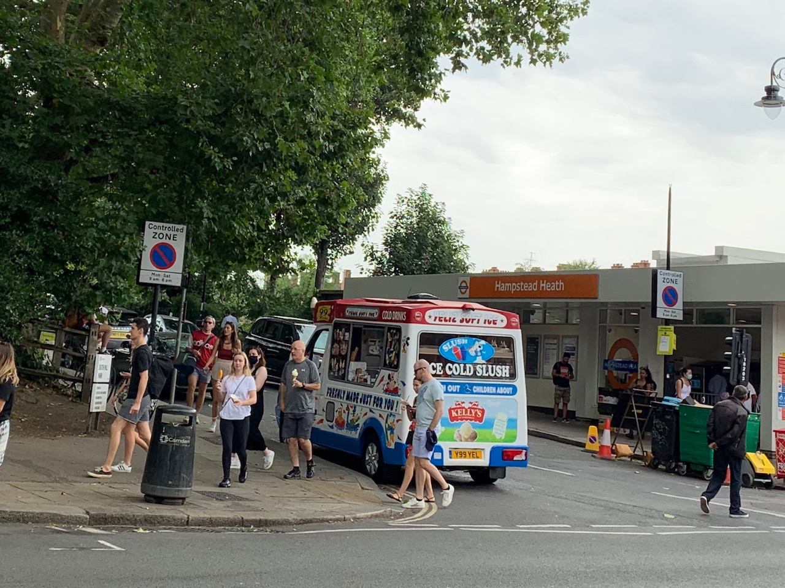

Looking for Mr Whippy
=====================


Ice-cream vans are often observed in summer parked at the northern corner of South End Road and South Hill Park. It is an ideal location for selling ice cream, right in the stream of foot traffic entering Hampstead Heath from South End Green and from Hampstead Heath Overground station. 

[](https://goo.gl/maps/JchNf7Kv4x5AEKu67 "Click for Google Map")

But selling ice cream there

-   blocks drivers’ sight lines between South End Road and South Hill Park, making the junction dangerous 
-   draws children onto the road at the junction 
-   poisons the air there as operators run their diesel engines to power refrigeration 

The corner is marked with double yellow lines to show that parking is forbidden there at all times. The area is well patrolled by civil enforcement officers. 

The location is said to be so profitable that Penalty Charge Notices (PCNs) do not deter the operators, which makes it questionable whether Camden should continue to allow offenders to avoid prosecution by accepting a PCN. 

But how many PCNs does Camden actually issue for the offence at this location? 


Method
------
We downloaded from opendata.camden.gov.uk the PCN tables for financial years 2017-18, 2018-19, and 2019-20, (728,695 records), and appended 37,748 records for the current financial year as updated on 16 August 2020.


### Location

The location in question (hereafter Location) is at the bottom of South Hill Park right at its junction with South End Road, at the entrance to Hampstead Heath. 

We treated the accuracy of GPS co-ordinates with caution and searched for PCNs within 100 metres of the 4-car parking bay opposite Hampstead Heath Overground station. Coordinates for this location were taken from Camden’s table of parking bays.


###  Notes on the data

-   Timestamps are in dd/mm/yyyy format. 
-   Times are recorded in 12-hour format with an `AM` or `PM` suffix.


### Filters

Records were filtered as follows.

1.  Location: with 1/1000 degree of latitude and longitude (roughly 100m) from the location of the 4-car parking bay, and on either South End Road or South Hill Park. (The latter is where the offence in question actually occurs.)
2.  Time: between 9am and 7pm in the months from April through September inclusive.
3.  Vehicle category: the records from 2017-18 onwards contain [84 distinct values for Vehicle Category](vt.csv), of which the most common is `1n/A`. The filter excludes only those values which could not refer to any kind of van, such as `Taxi` or `2 Door Saloon`. 
4.  Status: excluded `Cancelled`.
5.  Foreign: excluded foreign registrations.

The script’s filters yield a table `local` of 903 records, saved as [`local.csv`](local.csv).

The database has 122 values for contravention code. 
Inspection (see [`off.csv`](off.csv)) finds only `1` and `2` as candidates for parking on double yellow lines.
An enforcement officer confirmed verbally that these are the correct codes.

Querying the `local` table for records where the contravention code is either 1 or 2 yields the following.

```q
q)select cdate,ctime,ccode,cdesc,street,vcat,long,lat,socrata from local where ccode in 1 2
cdate      ctime ccode cdesc                                                 street          vcat    long      lat      socrata
-------------------------------------------------------------------------------------------------------------------------------
2020.08.08 13:50 1     Parked in a restricted street during prescribed hours SOUTH HILL PARK Van     -0.166066 51.55535 825098
2019.09.23 10:14 1     Parked in a restricted street during prescribed hours SOUTH END ROAD  Van     -0.166336 51.55511 767090
2019.06.10 16:20 1     Parked in a restricted street during prescribed hours SOUTH HILL PARK 1n/A    -0.166536 51.55519 752449
2018.07.10 15:56 1     Parked in a restricted street during prescribed hours SOUTH HILL PARK Box Van -0.16554  51.55542 809700
2018.05.27 11:30 1     Parked in a restricted street during prescribed hours SOUTH END ROAD  1n/A    -0.166378 51.5553  811309
2017.07.17 16:03 1     Parked in a restricted street during prescribed hours SOUTH HILL PARK 1n/A    -0.16647  51.55559 792802
2017.07.05 15:47 1     Parked in a restricted street during prescribed hours SOUTH HILL PARK 1n/A    -0.166077 51.55535 764951
2017.06.02 16:42 1     Parked in a restricted street during prescribed hours SOUTH END ROAD  1n/A    -0.165883 51.55486 783456
```


Requirements
------------
-   The q language, which is part of kdb+. A copy for non-commercial use can be obtained gratis from [code.kx.com](https://code.kx.com/q/learn/install/).
-   About 700MB disk space


Evidence
--------
1.  Script [`qry.q`](qry.q) for loading and filtering records from CSVs downloaded from `opendata.camden.gov.uk`
2.  [`local.csv`](local.csv) as described above. (The table is small enough to be searched conveniently in a spreadsheet.)


Visual confirmation
-------------------
On 2020-08-08 an ice-cream van was observed operating in the middle of the day at the Location. An enforcement officer attended. This incident appears to correspond to Socrata record 825098. 


Other candidate records
-----------------------
The vehicle in Socrata record 825098 is recorded correctly as a Van, and the street correctly as South Hill Park.
This is the only record of any date that precisely matches the offence of parking a van at the Location. 

The second-best match is from 2017-07-05 (Socrata 764951). The co-ordinates match record 825098, but there is no indication of vehicle type. 


Comparison
----------
For constrast, in the same time period, enforcement officers issued nearly three thousand PCNs on the two streets South Hill Park and South End Road.

```q
q)count select from (onsummerday pcn,curr) where street in STREETS
2987
```


Conclusion
----------
Between 2017-04-01 and 2020-08-16, Camden issued at least two and at most eight PCNs in summer daytime for parking on the double yellow lines at the corner of South Hill Park and South End Road NW3. Only five of these PCNs were for offences in South Hill Park.

If the location co-ordinates are precise and accurate then only two PCNs were issued for parking on the double-yellow lines at the Location during the entire period, of which one has been confirmed as an ice-cream van. 

